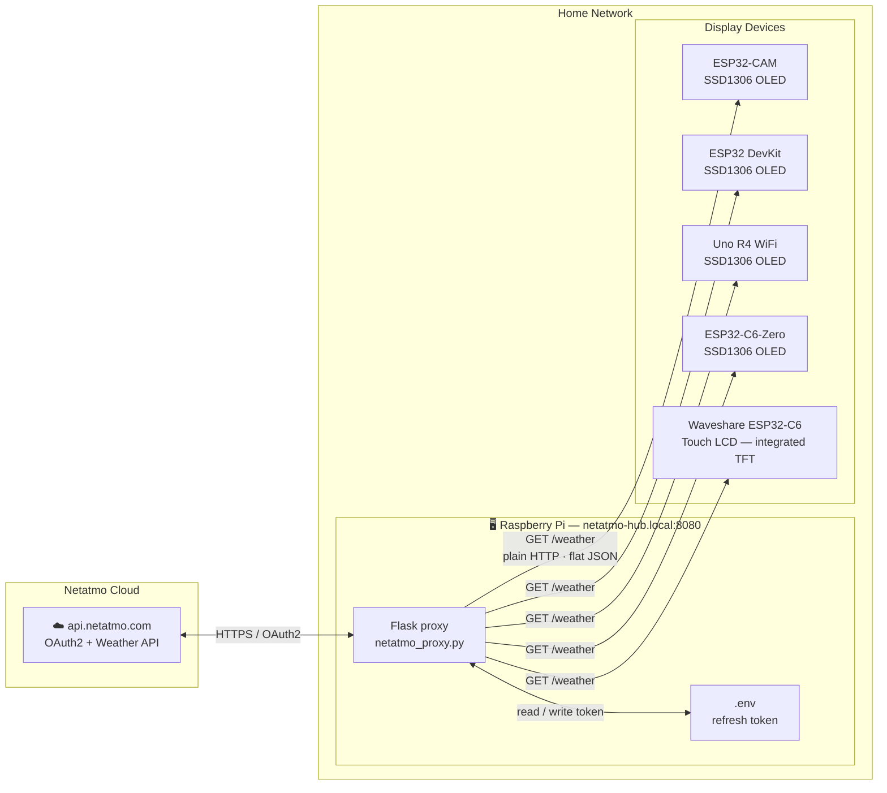
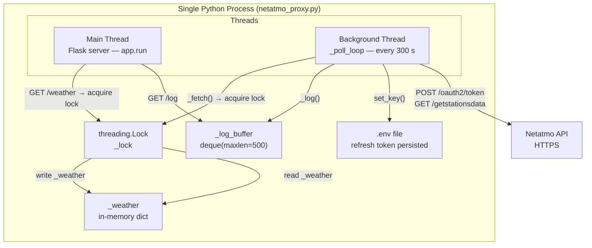
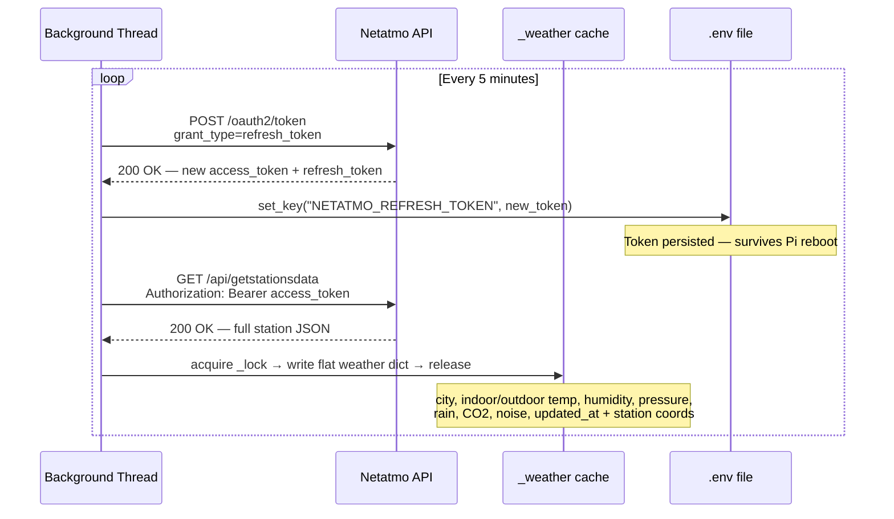
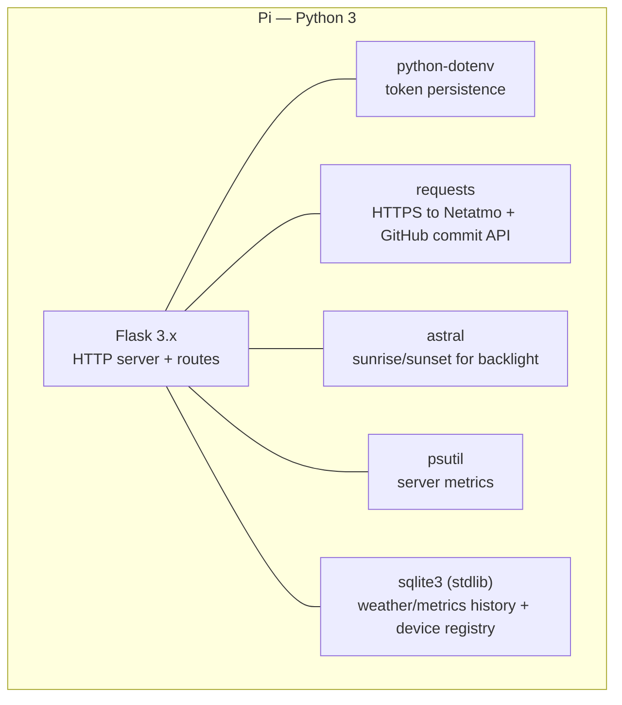

# Architecture

## System Overview

The Pi proxy is the only component that ever talks to Netatmo. It polls every 5 minutes, caches the result in memory, and serves it to any device on the local network over plain HTTP. Devices never hold credentials.

Device-side internals (boot sequence, main loop, per-board timing, firmware stack, hardware) live in the firmware repo: [home-hub-firmware/docs/architecture.md](https://github.com/vcchstrandberg/home-hub-firmware/blob/main/docs/architecture.md).

---

## Pi Proxy Internals

The Flask server and the background polling thread run in the same process. All reads and writes to `_weather` go through `_lock`. `_log_buffer` is a `collections.deque` — CPython's GIL guarantees atomicity of `append` without needing an explicit lock.

---

## Token Refresh and Data Fetch Sequence

Netatmo issues rotating refresh tokens — each successful refresh invalidates the old token and issues a new one. Writing it back to `.env` ensures the Pi never permanently loses API access across reboots or power cuts. You only need to paste the initial token once during setup. The station's coordinates (from the Netatmo `place` block) are also captured here and feed the time-of-day backlight calculation — see [server.md](server.md).

---

## Software Stack (Pi)

The device-side software stack and PlatformIO platforms are documented in the [firmware architecture doc](https://github.com/vcchstrandberg/home-hub-firmware/blob/main/docs/architecture.md).
