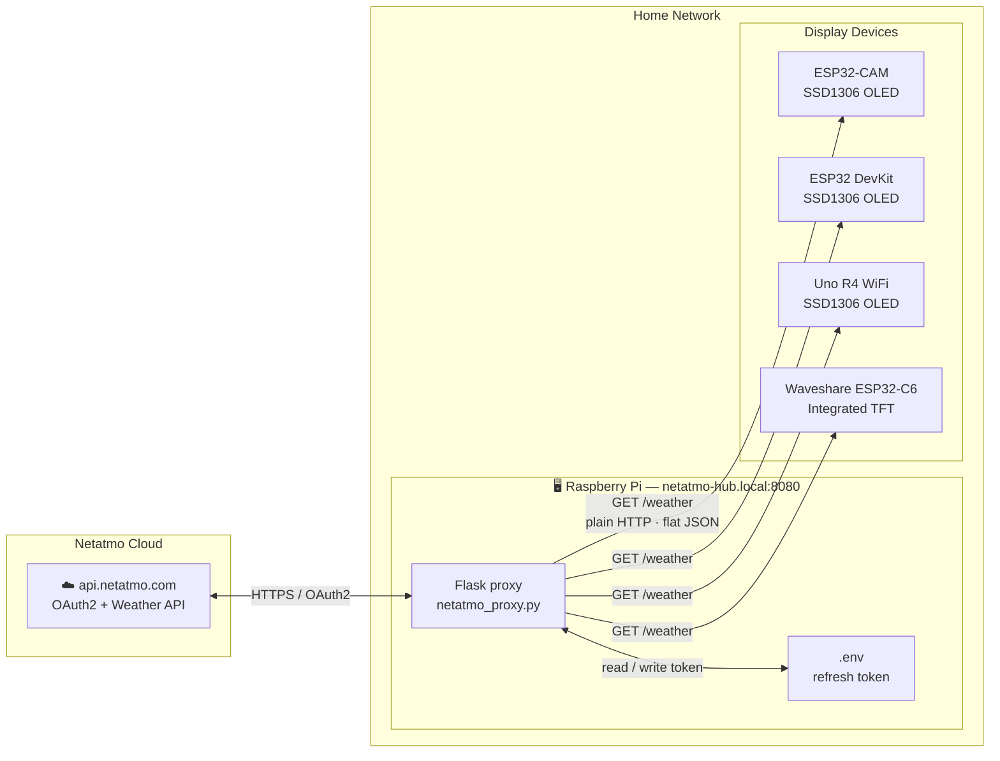
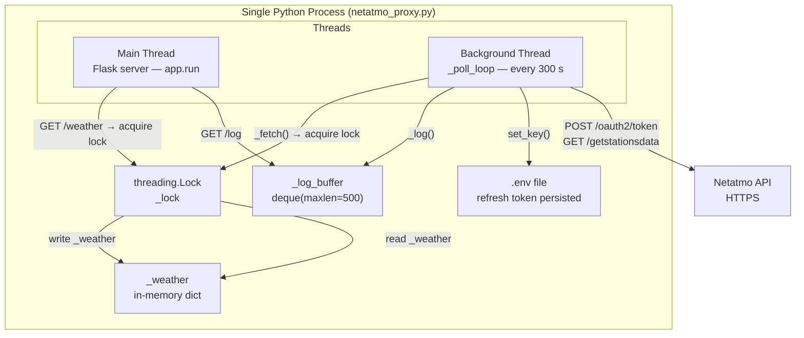
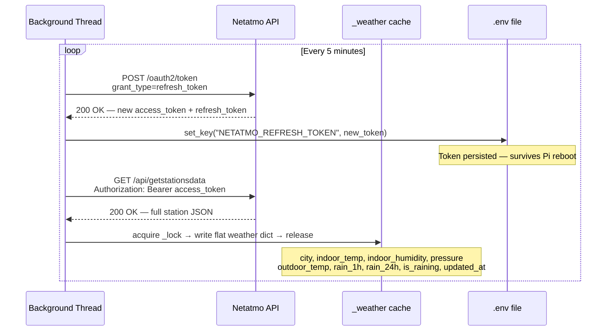
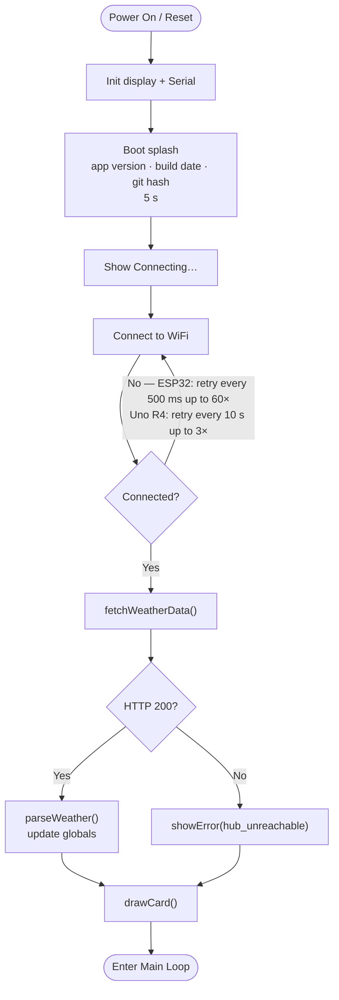
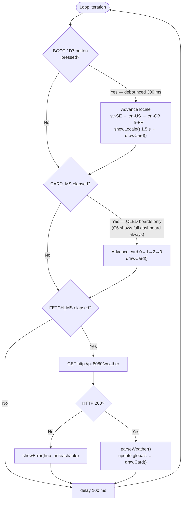
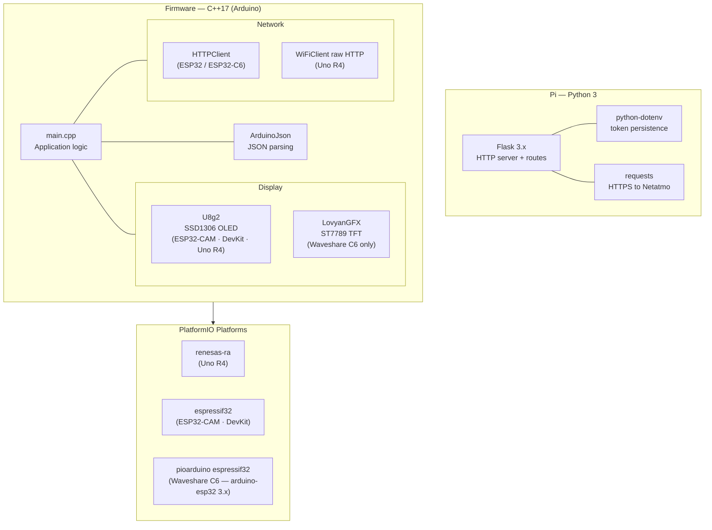
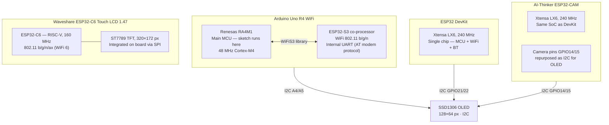

# Architecture

## System Overview

The Pi proxy is the only component that ever talks to Netatmo. It polls every 5 minutes, caches the result in memory, and serves it to any device on the local network over plain HTTP. Devices never hold credentials.

---

## Pi Proxy Internals

The Flask server and the background polling thread run in the same process. All reads and writes to `_weather` go through `_lock`. `_log_buffer` is a `collections.deque` — CPython's GIL guarantees atomicity of `append` without needing an explicit lock.

---

## Token Refresh and Data Fetch Sequence

Netatmo issues rotating refresh tokens — each successful refresh invalidates the old token and issues a new one. Writing it back to `.env` ensures the Pi never permanently loses API access across reboots or power cuts. You only need to paste the initial token once during setup.

---

## Device — Boot Sequence

---

## Device — Main Loop

**Timing by board:**

| Board | Card rotation (CARD_MS) | Fetch interval (FETCH_MS) |
|---|---|---|
| ESP32-CAM | 5 s | 5 min |
| ESP32 DevKit | 5 s | 5 min |
| Uno R4 WiFi | 5 s | 60 s |
| Waveshare ESP32-C6 | Never — full dashboard | 5 min |

The Uno R4 fetches more frequently because its WiFi module (ESP32-S3 co-processor) keeps the connection open; the ESP32 boards use the same always-on polling approach but at a slower rate to reduce Netatmo API load.

---

## Software Stack

---

## Hardware Overview

